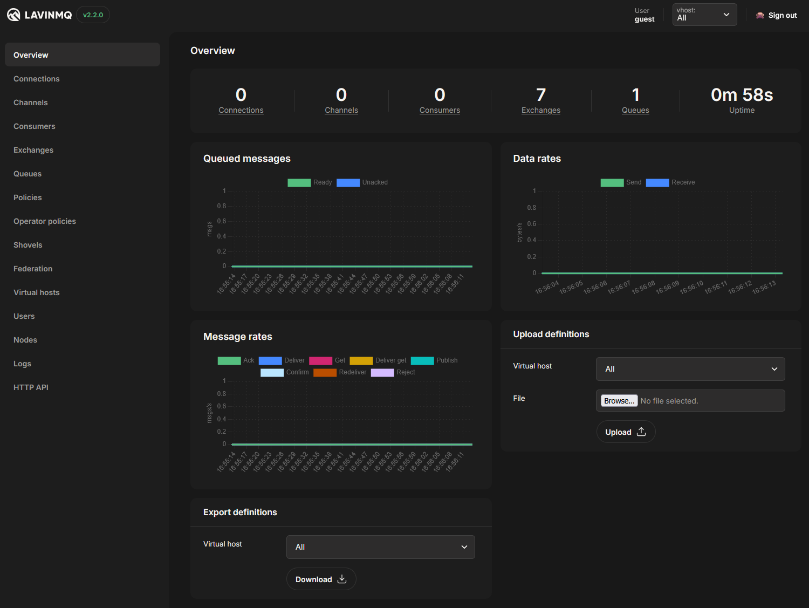

[](https://github.com/cloudamqp/lavinmq/actions)
[](https://cirrus-ci.com/github/cloudamqp/lavinmq)
[](https://github.com/cloudamqp/lavinmq/blob/master/LICENSE)
[](https://github.com/cloudamqp/lavinmq/releases)

# 

LavinMQ is a high-performance message queue & streaming server implementing the AMQP 0-9-1 and MQTT 3.1.1 protocols.
Built with [Crystal](https://crystal-lang.org/) for optimal efficiency.



- **Lightning Fast**: Exceptional throughput performance
- **Resource Efficient**: Minimal RAM requirements
- **Highly Scalable**: Handles very long queues and numerous connections
- **Simple Setup**: Requires minimal configuration to get started

Discover more at [LavinMQ.com](https://lavinmq.com)

## Installation

See [Installation guide](https://lavinmq.com/documentation/installation-guide) for more information on installing LavinMQ. 

### Debian/Ubuntu

```sh
curl -fsSL https://packagecloud.io/cloudamqp/lavinmq/gpgkey | gpg --dearmor | sudo tee /usr/share/keyrings/lavinmq.gpg > /dev/null
. /etc/os-release
echo "deb [signed-by=/usr/share/keyrings/lavinmq.gpg] https://packagecloud.io/cloudamqp/lavinmq/$ID $VERSION_CODENAME main" | sudo tee /etc/apt/sources.list.d/lavinmq.list
sudo apt-get update
sudo apt-get install lavinmq
```

### Fedora

```sh
sudo tee /etc/yum.repos.d/lavinmq.repo << 'EOF'
[lavinmq]
name=LavinMQ
baseurl=https://packagecloud.io/cloudamqp/lavinmq/fedora/$releasever/$basearch
gpgkey=https://packagecloud.io/cloudamqp/lavinmq/gpgkey
repo_gpgcheck=1
gpgcheck=0
EOF
sudo dnf install lavinmq
```

### Archlinux

The package is available on [AUR](https://aur.archlinux.org/packages/lavinmq),
it depends on `gc-large-config` (that conflicts with `gc` package package), it
is the very same gc package found in ArchLinux but compiled with
`--enable-large-config`.

Then use systemctl to start/stop/enable/disable it, e.g. `systemctl start lavinmq`.

### OS X

Install LavinMQ with `brew`: 

```sh
brew install cloudamqp/cloudamqp/lavinmq
```

### Docker

Docker images are published to [Docker Hub](https://hub.docker.com/r/cloudamqp/lavinmq).
Fetch and run the latest version with:

```sh
docker run --rm -it -p 5672:5672 -p 15672:15672 -v /tmp/amqp:/var/lib/lavinmq cloudamqp/lavinmq
```

#### Docker Compose
Minimal example on how to run LavinMQ with Docker compose.

```yaml
services:
  lavinmq:
    image: "cloudamqp/lavinmq:latest"
    ports:
      - 15672:15672 # HTTP
      - 5672:5672   # AMQP
```
Start the container by running `docker compose up`

For an example on setting up a multi-node LavinMQ cluster with Docker Compose, see [Setting up a LavinMQ cluster with Docker Compose](https://lavinmq.com/documentation/docker-compose-cluster)

### Windows

For running LavinMQ on Windows, we recommend using WSL (Windows Subsystem for Linux). Install your preferred Linux distribution through WSL, then follow the installation instructions for that distribution above.

### From Source

Begin with installing Crystal. Refer to
[Crystal's installation documentation](https://crystal-lang.org/install/)
on how to install Crystal.

Clone the git repository and build the project.

```sh
git clone git@github.com:cloudamqp/lavinmq.git
cd lavinmq
make
sudo make install # optional
```

## Using LavinMQ

### Getting Started

For a quick start guide on using LavinMQ, see the [getting started documentation](https://lavinmq.com/documentation/getting-started).

### Running LavinMQ

LavinMQ only requires one argument: a path to a data directory.

```sh
lavinmq -D /var/lib/lavinmq
```

More configuration options can be viewed with `-h`,
and you can specify a configuration file too, see [extras/lavinmq.ini](extras/lavinmq.ini)
for an example, or see the section on [config files in the documentation](https://lavinmq.com/documentation/configuration-files).

### Client Libraries

All AMQP client libraries work with LavinMQ, and there are AMQP client libraries for almost every platform. The LavinMQ website has guides for many common platforms:

- [Ruby](https://lavinmq.com/documentation/ruby-sample-code)
- [Node.js](https://lavinmq.com/documentation/nodejs-sample-code)
- [Java](https://lavinmq.com/documentation/java-sample-code)
- [Python](https://lavinmq.com/documentation/python-sample-code)
- [PHP](https://lavinmq.com/documentation/php-sample-code)
- [Crystal](https://lavinmq.com/documentation/crystal-sample-code)
- [Go](https://lavinmq.com/documentation/go-sample-code)
- [.NET](https://lavinmq.com/documentation/dot-net-sample-code)

## Performance

LavinMQ delivers exceptional throughput performance on commodity hardware. On a single c8g.large EC2 instance with GP3 EBS storage (XFS formatted), LavinMQ achieves:

**Throughput Benchmarks:**
- **800,000 msgs/s** - End-to-end throughput (16-byte messages, single queue, single producer/consumer)
- **1,600,000 msgs/s** - Producer-only performance
- **1,200,000 msgs/s** - Consumer-only performance (auto-ack)

**Memory Efficiency:**
- **25 MB RAM** - For 100 million enqueued messages
- **45 MB RAM** - For 1,000 declared queues
- **70 MB RAM** - For 1,000 concurrent connections

**Binding Performance:**
- **1,600 bindings/s** - Non-durable queues
- **1,000 bindings/s** - Durable queues

Use [lavinmqperf](https://lavinmq.com/documentation/lavinmqperf) to benchmark your own setup, or review detailed performance data at [lavinmq-benchmark](https://github.com/cloudamqp/lavinmq-benchmark/blob/main/results/lavinmq_throughput.md) on GitHub.

## Features

### Core Protocols
- AMQP 0-9-1 protocol support
- MQTT 3.1.1 protocol support
- AMQPS (TLS)
- AMQP over websockets
- MQTT over websockets

### Messaging Capabilities
- Publisher confirm
- Transactions
- Dead-lettering
- TTL support on queue, message, and policy level
- CC/BCC
- Alternative exchange
- Exchange to exchange bindings
- Direct-reply-to RPC
- Queue max-length
- Priority queues
- Delayed exchanges
- Message deduplication

### Management
- HTTP API
- Users and ACL rules
- VHost separation
- Policies
- Importing/export definitions
- Consumer cancellation

### High Availability
- Replication
- Automatic leader election in clusters via etcd

### Other Functionality
- Shovels
- Queue & Exchange federation
- Single active consumer
- Stream queues

## Feature Highlights
### Clustering

LavinMQ can be fully clustered with multiple other LavinMQ nodes. One node is always the leader and the others stream all changes in real-time. Failover happens instantly when the leader is unavailable.

[etcd](https://etcd.io/) is used for leader election and maintaining the In-Sync-Replica (ISR) set. LavinMQ then uses a custom replication protocol between the nodes. When a follower disconnects it will fall out of the ISR set, and will then not be eligible to be a new leader.

See [Setting up Clustering with LavinMQ](https://lavinmq.com/documentation/clustering) for more information on Clustering in LavinMQ.

#### Clustering Configuration

Enable clustering with the following config:

```ini
[clustering]
enabled = true
bind = ::
port = 5679
advertised_uri = tcp://my-ip:5679
etcd_endpoints = localhost:2379
```

or start LavinMQ with:

```sh
lavinmq --data-dir /var/lib/lavinmq --clustering --clustering-bind :: --clustering-advertised-uri=tcp://my-ip:5679
```

### Stream Queues

Stream queues provide an append-only log structure that allows multiple consumers to read the same messages independently. Unlike standard queues, messages in stream queues aren't deleted when consumed, making them ideal for event sourcing patterns and multi-consumer scenarios.

Each consumer can start reading from anywhere in the queue using the `x-stream-offset` consumer argument and can process messages at their own pace. See [Stream Queues](https://lavinmq.com/documentation/streams) in the documentation for more information on using Stream Queues. 

#### Stream Queue Filtering

Stream queues support message filtering, allowing consumers to receive only messages that match specific criteria. This is useful for consuming a subset of messages without creating multiple queues. For more information on filtering, see the [documentation](https://lavinmq.com/documentation/streams#stream-filtering).

### MQTT Support

LavinMQ natively supports the MQTT 3.1.1 protocol, facilitating seamless integration with IoT devices, sensors, and mobile applications. Each MQTT session is backed by an AMQP queue, ensuring consistent and reliable message storage. Messages within these sessions are persistently stored on disk.

For retained messages, LavinMQ maintains a dedicated storage system that maps topics to their respective retained messages. These retained messages are also persistently stored, ensuring that new subscribers immediately receive the latest retained message upon subscribing, including those using wildcard topic filters. In a clustered environments, the retained message store is replicated across nodes.

Please note that Quality of Service (QoS) level 2 is not supported in LavinMQ; messages published with QoS 2 will be downgraded to QoS 1.

See [MQTT in LavinMQ](https://lavinmq.com/documentation/mqtt-in-lavinmq) for more information on using MQTT.

#### MQTT Configuration

```ini
[MQTT]
bind = "127.0.0.1"
port = 1883
tls_port = 8883
unix_path = ""
max_inflight_messages = 65535
default_vhost = "/"
```

## Implementation Details

LavinMQ is built in Crystal and uses a disk-first approach to message storage, letting the OS handle caching. For full details on implementation, storage architecture, and message flows, see the [Implementation details section in CONTRIBUTING.md](CONTRIBUTING.md).

## Compatibility Notes

There are a few edge-cases that are handled a bit differently in LavinMQ compared to other AMQP servers:

- When comparing queue/exchange/binding arguments all number types (e.g. 10 and 10.0) are considered equivalent
- When comparing queue/exchange/binding arguments non-effective parameters are also considered, and not ignored
- TTL of queues and messages are accurate to 0.1 second, not to the millisecond
- Newlines are not removed from Queue or Exchange names, they are forbidden

## Getting Help

For questions or suggestions:
- Join our [Slack community](https://join.slack.com/t/lavinmq/shared_invite/zt-1v28sxova-wOyhOvDEKYVQMQpLePNUrg)
- Use the [lavinmq tag](https://stackoverflow.com/questions/tagged/lavinmq) on Stack Overflow
- Want to learn more? [Talk with our product experts](https://webforms.pipedrive.com/f/64JnLsqIMAdF2BDQ06ioKLhC2NuNmkwNplNhRxtIqlm0nFnuIeX97eb7fZKej0vFHZ)

## Hosted Solutions

[CloudAMQP](https://www.cloudamqp.com/plans.html#lmq) offers a hosted LavinMQ solution with 24/7 support. 

For assistance with a CloudAMQP-hosted LavinMQ instance, contact [support@cloudamqp.com](mailto:support@cloudamqp.com).

## Contributing

Please read our [contributing guide](CONTRIBUTING.md) if you'd like to help improve LavinMQ.

## License

The software is licensed under the [Apache License 2.0](LICENSE).

Copyright 2018-2025 84codes AB

LavinMQ is a trademark of 84codes AB
